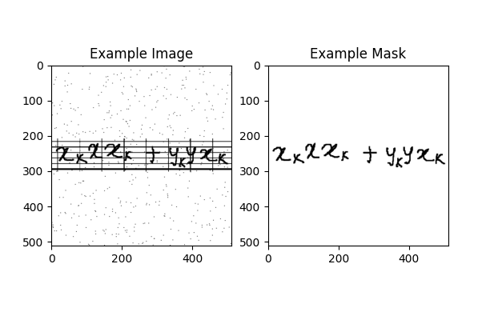
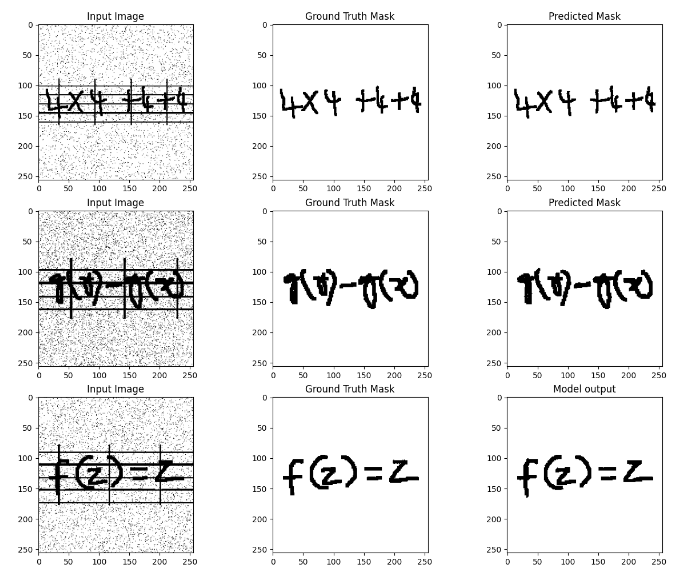
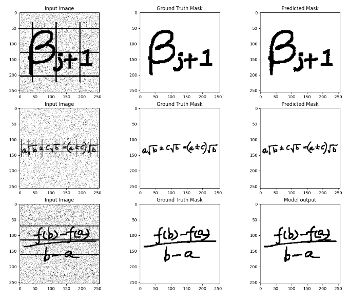
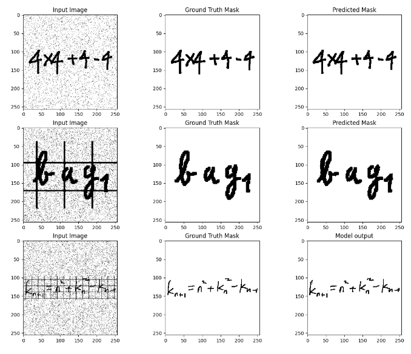
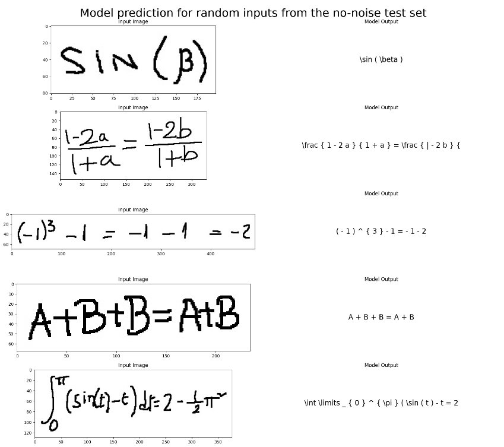
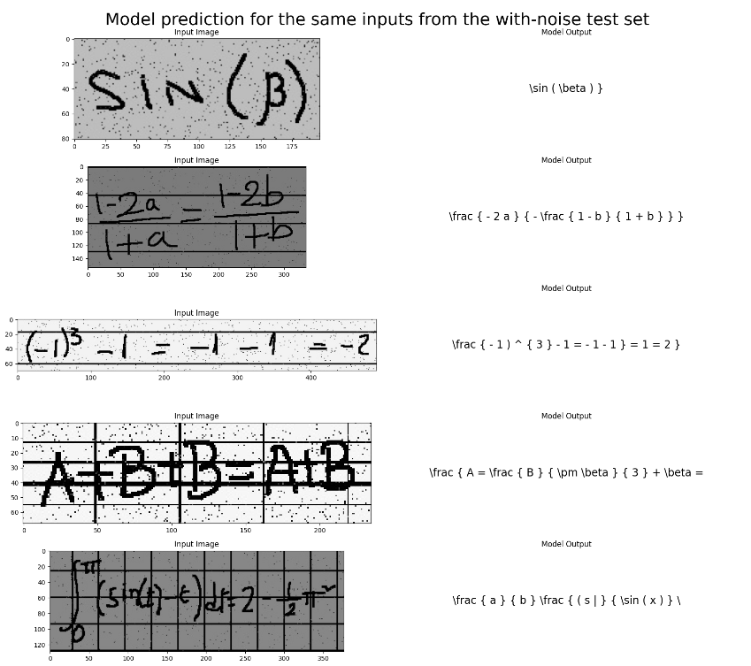

# U-net De-noising model for Transformer Optical Recognition for Mathematical equations

[](LICENSE)
[](https://github.com/AymenBOUGUERRA/UDM-TrOCRM/issues)
[](https://github.com/AymenBOUGUERRA/UDM-TrOCRM/pulls)

Brief description of your project.

## Table of Contents

- [Features](#features)
- [Getting Started](#getting-started)
  - [Prerequisites](#prerequisites)
  - [Installation](#installation)
- [Usage](#usage)
- [Results](#results)
- [License](#license)
- [Acknowledgments](#acknowledgments)

## Features

- Creation and training from scratch of a U-net model for de-noising and removing grids from the images of student's 
textbooks and only keeping the necessary data to be fed to the OCR.
- the use of transfer learning and retraining on TrOCR on handwritten mathematical equations with latex outputs to create
a model to help solve the problem.


## Getting Started

### Prerequisites

Python 3.9.

An Nvidia GPU will be needed.

### Installation

- Glone this project:

```git clone https://github.com/AymenBOUGUERRA/UDM-TrOCRM.git```

- Install the dependencies and prepare the environment

```pip install -r requirements.txt```


- Datasets:

  - UDM training and  testing data: https://drive.google.com/file/d/1E8aBNRIH72zllvkCx9zKS62P1d6_SBw7/view?usp=sharing 
  - TrOCR clear training and testing data: https://drive.google.com/file/d/1rNEOyhvY2cCnYeaQRS_gda9313xFywHP/view?usp=sharing
  - TrOCR noise testing data: https://drive.google.com/file/d/1UzHkOMbJQx3OnHMKstCTVBBVfVWrVlVM/view?usp=sharing


- Pre-trained models (optional):

  - UDM model https://drive.google.com/file/d/1SUPXum816XnfmNEsQyiuEU2XnLHm5cX5/view?usp=sharing
  - TrOCRM model: https://drive.google.com/file/d/1GLRs74S7dMqal0YG7yNOKTv6nSLud3Nt/view?usp=sharing


- Put ```TrOCRM_clear_data.rar``` ```TrOCRM_noise_data.rar``` and ```data_unet_grey_interline_noise.rar``` in the root
directory of the project, do not extract them, it will be done automatically when you run a script.


- (optional) Extract the U-NET model in the root directory of the project so that you have ```UDM-TrOCRM/my_models_savedmodel/*```.


- (optional) Extract the TrOCR checkpoint in a file so that you have ```UDM-TrOCRM/TrOCRM_models/checkpoint-6500/*```.


## Usage

Argparse was not used in these scripts, you can directly run the needed script without any arguments.

- You can train the models using the ```Data_preparation_and_UDM_model_training.py``` and ```TrOCRM_training.py``` scripts.

Warning: TrOCR models have a large volume, make use to have the necessary space (about 5 Go per model/checkpoint)


- You can test the models using the ```UDM_testing.py``` and ```TrOCRM_test.py``` scripts.


- You can compute the scores the TrOCRM model using the ```TrOCRM_score.py``` script.

## Results

On random images from the test sets: (not even loaded during training).
- UDM:
  - Example UDM training image:
  

  - Multiple example of UDM de-noising:







- TrOCR:

  - Multiple examples of the model's predictions on random input images from the test set with no noise:



  - Multiple examples of the model's predictions on random input images from the test set with noise:



  - Multiple examples of the model's predictions on random input images from the test set with noise the were de-noised
with UDM before the inference:


- Exact Match rate (Exp Rate) on noised test set: 0.4%  with a Character Error Rate (CER) of 76.6%


- Exact Match rate (Exp Rate) on clear test set: 26.3% with a Character Error Rate (CER) of 32.2%


## License

This project is licensed under the MIT License.

## Acknowledgments

- The research summarized in this article is part of the EU-fundend project IMEDiL (Inclusive Mathematics Education based on Digital Learning).
- Francesco Salvarani & Christophe Rodrigues from the DVRC for the help and guidance during this research and implementation.
