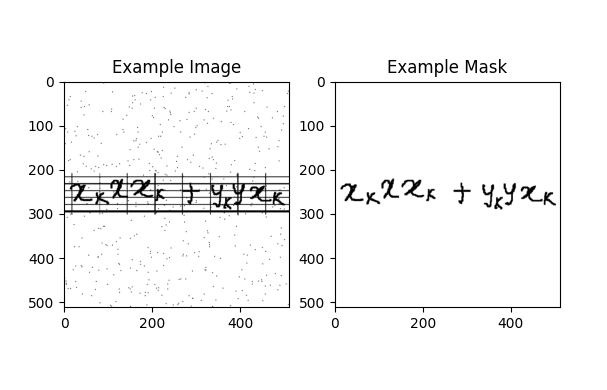
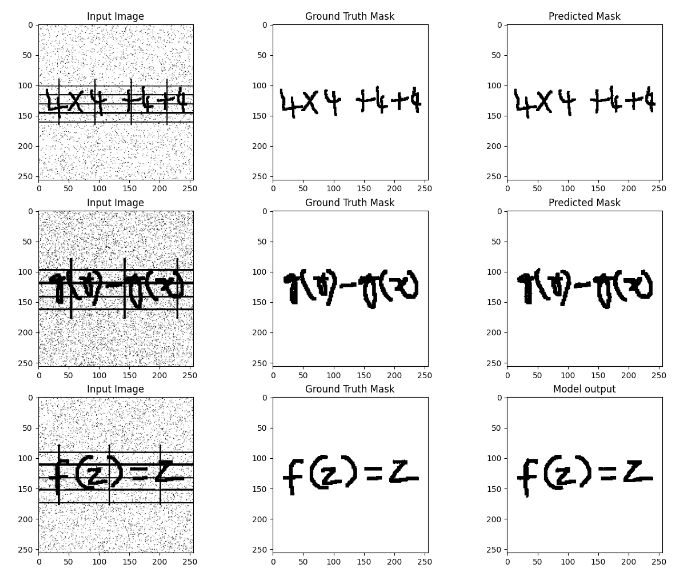
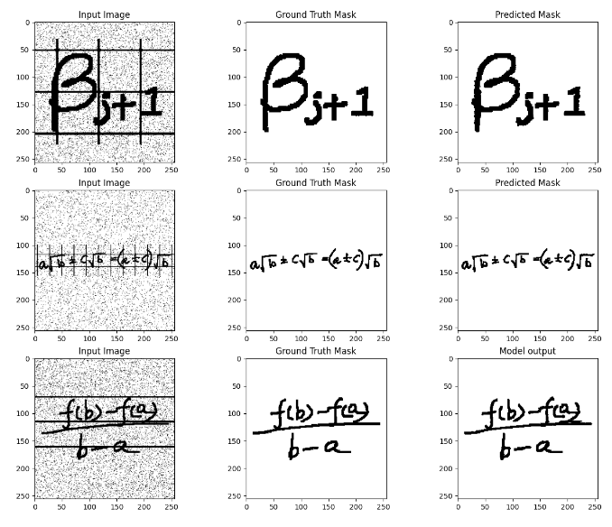
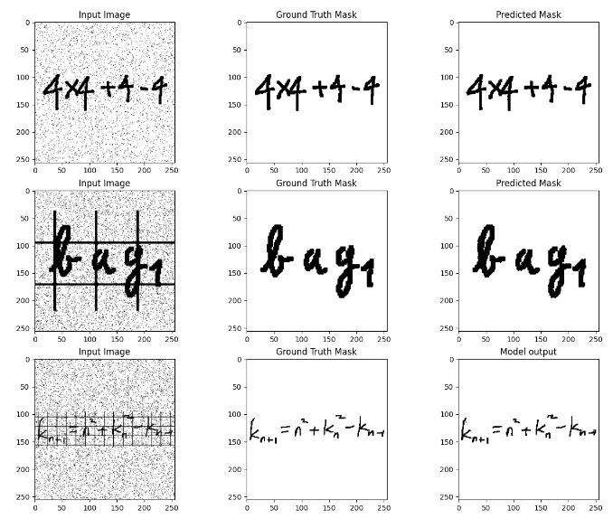
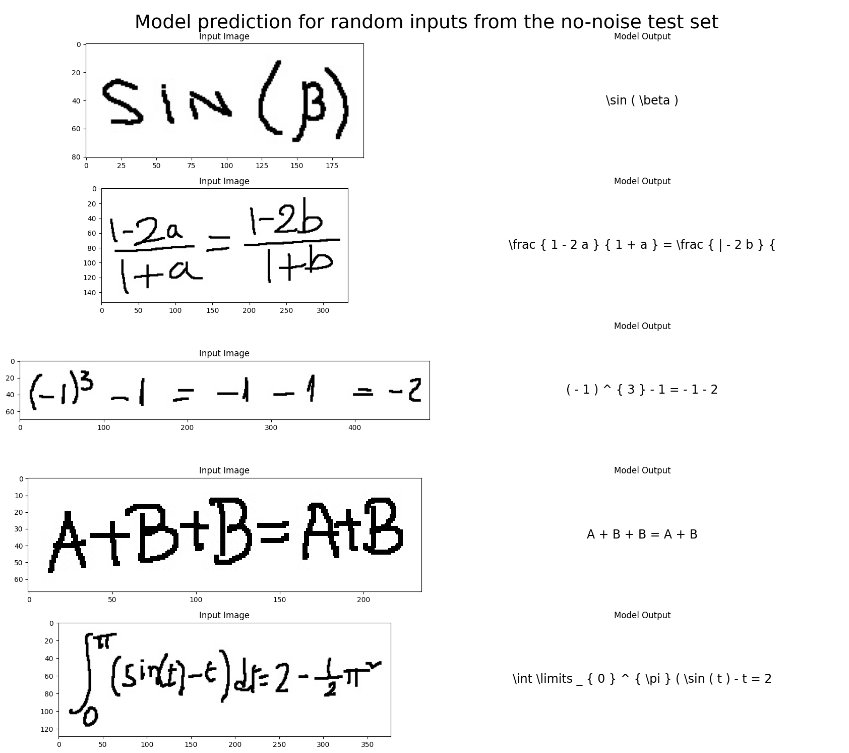
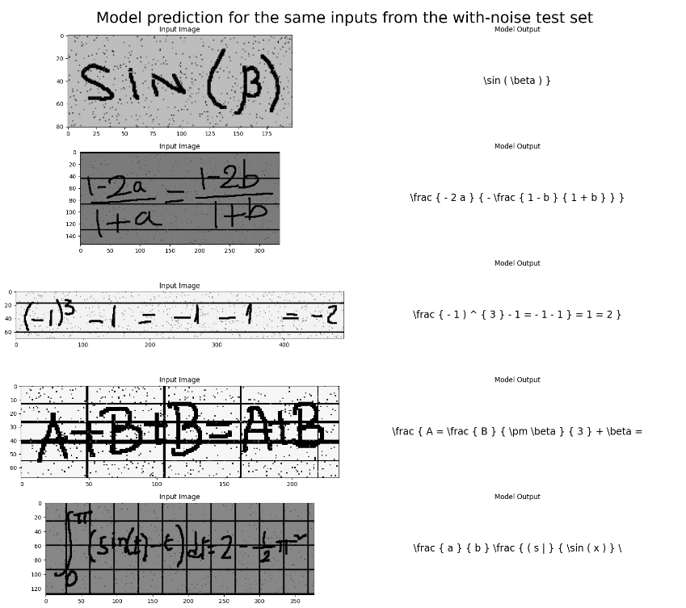

# Inclusive mathematics education based on digital learning
Project Reference : 2021-1-FR01-KA220-HED-000023486.

This work is part of the IMEDiL (Inclusive Mathematics Education based on Digital Learning) program that seeks to create digital tools to help and assist the impaired persuing STEM education.


# U-net De-noising model for Transformer Optical Recognition for Mathematical equations.

[](LICENSE)
[](https://github.com/AymenBOUGUERRA/UDM-TrOCRM/issues)
[](https://github.com/AymenBOUGUERRA/UDM-TrOCRM/pulls)

A two-stage pipeline for reading handwritten mathematical equations off scanned
student textbooks: a U-Net de-noising model (UDM) first removes the paper grid
and the scanning noise, then a fine-tuned TrOCR model transcribes the cleaned
image into LaTeX.

## Table of Contents

- [Features](#features)
- [Getting Started](#getting-started)
  - [Prerequisites](#prerequisites)
  - [Installation](#installation)
- [Usage](#usage)
- [Results](#results)
- [License](#license)
- [Acknowledgments](#acknowledgments)

## Features

- Creation and training from scratch of a U-net model for de-noising and removing grids from the images of student's 
textbooks and only keeping the necessary data to be fed to the OCR.
- the use of transfer learning and retraining on TrOCR on handwritten mathematical equations with latex outputs to create
a model to help solve the problem.


## Getting Started

### Prerequisites

Python 3.11 to 3.13.

An Nvidia GPU will be needed.

An archive tool able to read `.rar` files (`unrar`, `7z` or `bsdtar`) must be on
the `PATH`, since the datasets are extracted with `patool`.

### Installation

- Clone this project:

```git clone https://github.com/AymenBOUGUERRA/UDM-TrOCRM.git```

- Create an environment and install the dependencies

```
python -m venv .venv
source .venv/bin/activate      # .venv\Scripts\activate on Windows
pip install -r requirements.txt
```

`requirements.txt` only lists the direct dependencies; pip resolves the rest,
including the CUDA runtime packages that match your TensorFlow and PyTorch
builds.


- Datasets:

  - UDM training and  testing data: https://drive.google.com/file/d/1E8aBNRIH72zllvkCx9zKS62P1d6_SBw7/view?usp=sharing 
  - TrOCR clear training and testing data: https://drive.google.com/file/d/1rNEOyhvY2cCnYeaQRS_gda9313xFywHP/view?usp=sharing
  - TrOCR noise testing data: https://drive.google.com/file/d/1UzHkOMbJQx3OnHMKstCTVBBVfVWrVlVM/view?usp=sharing


- Pre-trained models (optional):

  - UDM model https://drive.google.com/file/d/1SUPXum816XnfmNEsQyiuEU2XnLHm5cX5/view?usp=sharing
  - TrOCRM model: https://drive.google.com/file/d/1GLRs74S7dMqal0YG7yNOKTv6nSLud3Nt/view?usp=sharing


- Put ```TrOCRM_clear_data.rar``` ```TrOCRM_noise_data.rar``` and ```data_unet_grey_interline_noise.rar``` in the root
directory of the project, do not extract them, it will be done automatically when you run a script.


- (optional) Extract the U-NET model in the root directory of the project so that you have ```UDM-TrOCRM/my_models_savedmodel/*```.


- (optional) Extract the TrOCR checkpoint in a file so that you have ```UDM-TrOCRM/TrOCRM_models/checkpoint-6500/*```.


Note on the U-Net model format: TensorFlow 2.16 and later ship Keras 3, which
saves models as a single ```udm_model.keras``` archive instead of a SavedModel
directory. Training now writes that file; the downloadable pre-trained model is
still a SavedModel directory and is loaded through ```TFSMLayer``` when no
```udm_model.keras``` is present. Both paths are handled by
```load_udm_model()``` in ```udm_common.py```.


## Usage

Argparse was not used in these scripts, you can directly run the needed script without any arguments.

- You can generate the noisy/clean image pairs used to train the U-Net with the ```create_noisy_dataset.py``` script.


- You can train the models using the ```Data_preparation_and_UDM_model_training.py``` and ```TrOCRM_training.py``` scripts.

Warning: TrOCR models have a large volume, make use to have the necessary space (about 5 Go per model/checkpoint)


- You can test the models using the ```UDM_testing.py``` and ```TrOCRM_test.py``` scripts.


- You can compute the scores of the TrOCRM model using the ```TrOCRM_score.py``` script. It reports the
Exact Match rate and the Character Error Rate, the latter computed with ```jiwer```.

## Results

On random images from the test sets: (not even loaded during training).
- UDM:
  - Example UDM training image:
 
  


  - Multiple example of UDM de-noising:







- TrOCR:

  - Multiple examples of the model's predictions on random input images from the test set with no noise:



  - Multiple examples of the model's predictions on random input images from the test set with noise:



  - Multiple examples of the model's predictions on random input images from the test set with noise the were de-noised
with UDM before the inference:


- Exact Match rate (Exp Rate) on noised test set: 0.4%  with a Character Error Rate (CER) of 76.6%


- Exact Match rate (Exp Rate) on clear test set: 26.3% with a Character Error Rate (CER) of 32.2%


## License

This project is licensed under the MIT License.

## Acknowledgments

- The research summarized in this article is part of the EU-fundend project IMEDiL (Inclusive Mathematics Education based on Digital Learning).
- Francesco Salvarani & Christophe Rodrigues from the DVRC for the help and guidance during this research and implementation.
